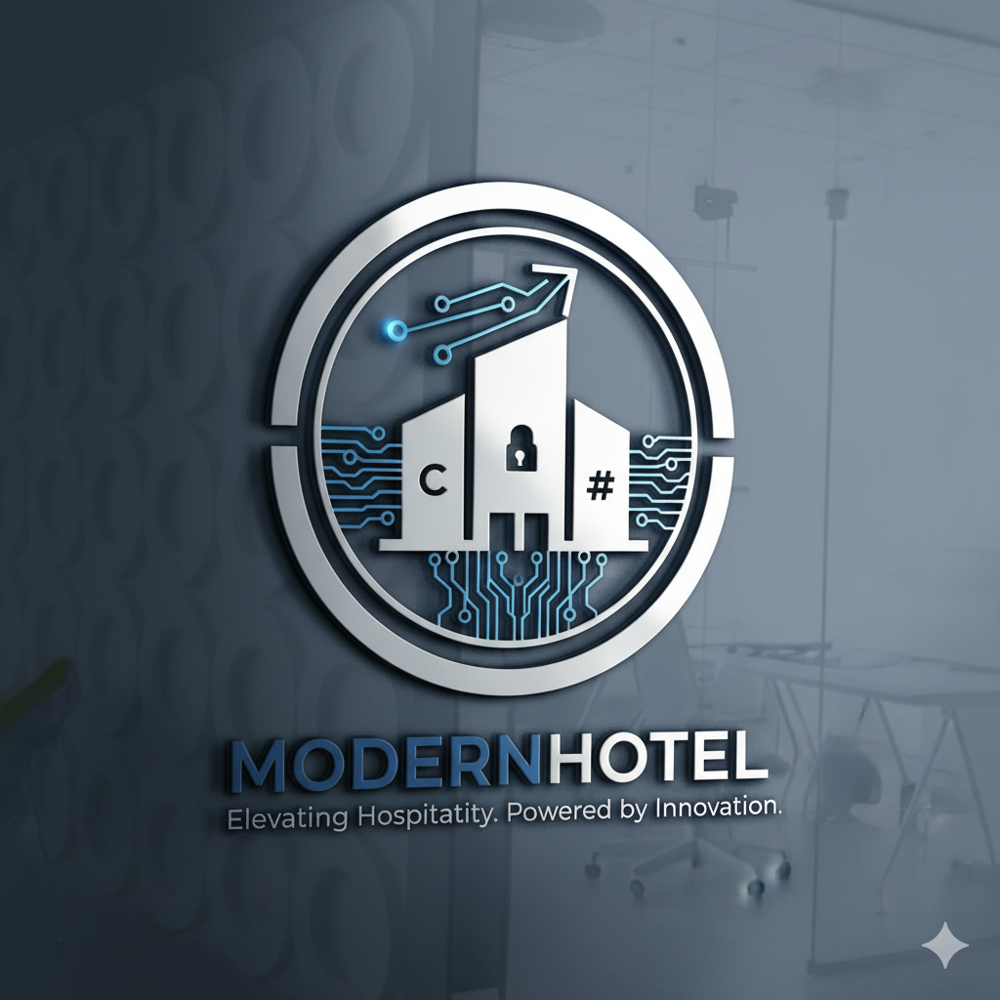

# Modern Hotel Management System


A comprehensive hotel management system built with C# and .NET, following Clean Architecture principles and modern software development best practices.

## Overview

Modern Hotel Management System is a complete solution for managing hotel operations, including room bookings, customer management, service management, billing, and reporting. The application is designed to be user-friendly, efficient, and scalable, making it suitable for hotels of all sizes.

## Architecture

The project follows Clean Architecture principles, with a clear separation of concerns and dependencies pointing inward:

```
                    ┌───────────────────┐
                    │                   │
                    │   Presentation    │
                    │                   │
                    └─────────┬─────────┘
                              │
                              │ depends on
                              ▼
                    ┌───────────────────┐
                    │                   │
                    │   Application     │
                    │                   │
                    └─────────┬─────────┘
                              │
                              │ depends on
                              ▼
                    ┌───────────────────┐
                    │                   │
                    │      Core         │
                    │                   │
                    └───────────────────┘
                              ▲
                              │ depends on
                              │
                    ┌───────────────────┐
                    │                   │
                    │  Infrastructure   │
                    │                   │
                    └───────────────────┘
```

### Project Structure

- **ModernHotel.Core**: Contains domain entities, enums, interfaces, and business logic that is independent of external concerns.
- **ModernHotel.Application**: Contains application-specific business rules, DTOs, interfaces, and services that orchestrate the flow of data to and from the domain entities.
- **ModernHotel.Infrastructure**: Contains implementations of the interfaces defined in the core and application layers, such as database access, file system access, and external services.
- **ModernHotel.Presentation**: Contains the user interface and presentation logic, implemented as a Windows Forms application.

## Features

### Room Management
- Create, update, and delete room types
- Create, update, and delete rooms
- View room availability
- Search for rooms based on various criteria

### Customer Management
- Create, update, and delete customer records
- Search for customers
- View customer history

### Booking Management
- Create, update, and cancel bookings
- Check-in and check-out customers
- View booking details
- Search for bookings based on various criteria

### Service Management
- Create, update, and delete service types
- Create, update, and delete services
- Assign services to bookings
- Track service usage

### Billing
- Generate bills for bookings
- Add services to bills
- Apply discounts
- Process payments
- Print bills

### Reporting
- Generate various reports, such as:
  - Occupancy reports
  - Revenue reports
  - Service usage reports
  - Customer statistics

### User Management
- Create, update, and delete user accounts
- Assign roles to users
- Manage user permissions

## Technologies Used

- **C# 10**: The primary programming language
- **Windows Forms**: For the user interface
- **.NET 6**: The framework used for building the application
- **Entity Framework Core**: For data access and ORM
- **SQL Server**: For data storage
- **AutoMapper**: For object-to-object mapping
- **Serilog**: For logging
- **xUnit**: For unit testing
- **Moq**: For mocking in unit tests
- **FluentValidation**: For input validation

## Design Patterns

The application implements several design patterns to ensure maintainability, testability, and scalability:

- **Repository Pattern**: For data access abstraction
- **Unit of Work Pattern**: For transaction management
- **Dependency Injection**: For loose coupling and testability
- **CQRS (Command Query Responsibility Segregation)**: For separating read and write operations
- **Mediator Pattern**: For decoupling components
- **Factory Pattern**: For creating objects
- **Strategy Pattern**: For implementing different algorithms
- **Observer Pattern**: For event handling
- **Decorator Pattern**: For adding behavior to objects

## Getting Started

### Prerequisites

- Visual Studio 2022 or later
- .NET 6 SDK
- SQL Server (LocalDB, Express, or higher)

### Installation

1. Clone the repository:
   ```
   git clone https://github.com/AyhamJo7/ModernHotel.git
   ```

2. Open the solution in Visual Studio:
   ```
   cd ModernHotel
   start ModernHotel.sln
   ```

3. Update the connection string in `ModernHotel.Presentation/appsettings.json` to point to your SQL Server instance.

4. Build the solution:
   ```
   dotnet build
   ```

5. Apply the database migrations:
   ```
   dotnet ef database update --project ModernHotel.Infrastructure --startup-project ModernHotel.Presentation
   ```

6. Run the application:
   ```
   dotnet run --project ModernHotel.Presentation
   ```

### Default Login

- Username: admin
- Password: Admin@123

## Contributing

Contributions are welcome! Please feel free to submit a Pull Request.

## License

This project is licensed under the MIT License - see the LICENSE file for details.

## Acknowledgments

- This project is a modernized version of a legacy hotel management system, with significant improvements in architecture, code quality, and features.
- Special thanks to all contributors who have helped make this project better.
